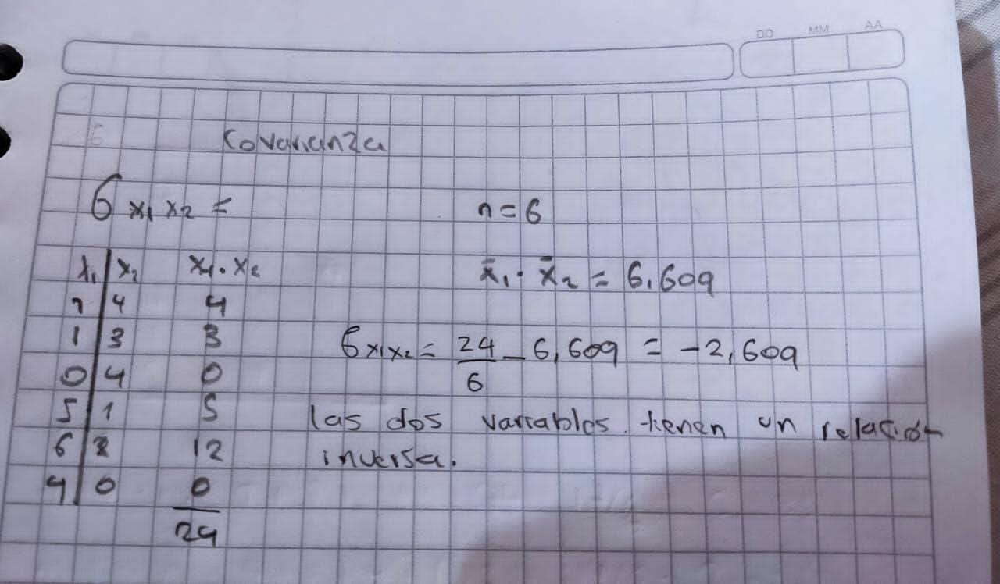
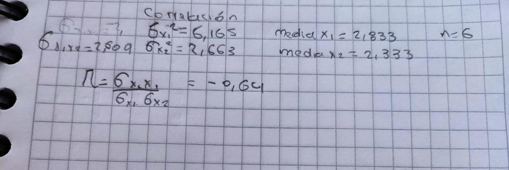
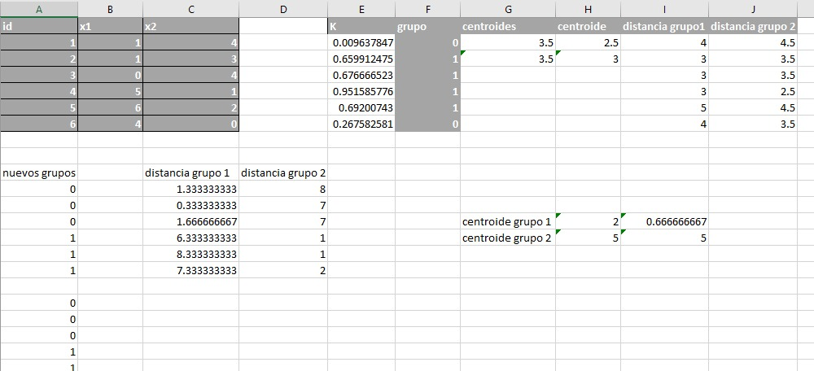

# Solucion Punto 1

### solucion punto 1.1, calcular la media, mediana, moda y desviacion standar, adjunto dos imagenes con todo el procedimiento asociado
- 
- 

### Solucion punto 1.2 dibujar un boxplot a mano

### Solucion 1.3 Cual es la covarianza entre las 2 variables X1, X2

### solucion 1.4 Cuál es la correlación entre la variable x1 y x2 (Calcularla a mano).Correlación puede ser escrita también como:

### solucion 1.5 Explica la relación entre covarianza y correlación
- Si la covarianza es positiva, la correlación será directa. Si la covarianza es negativa, la correlación será inversa, para nuestro caso, tenemos una covarianza y correlacion negativas, por ende podemos decir que la relacion entre las variables es inversa

### Solucion punto 1.6
