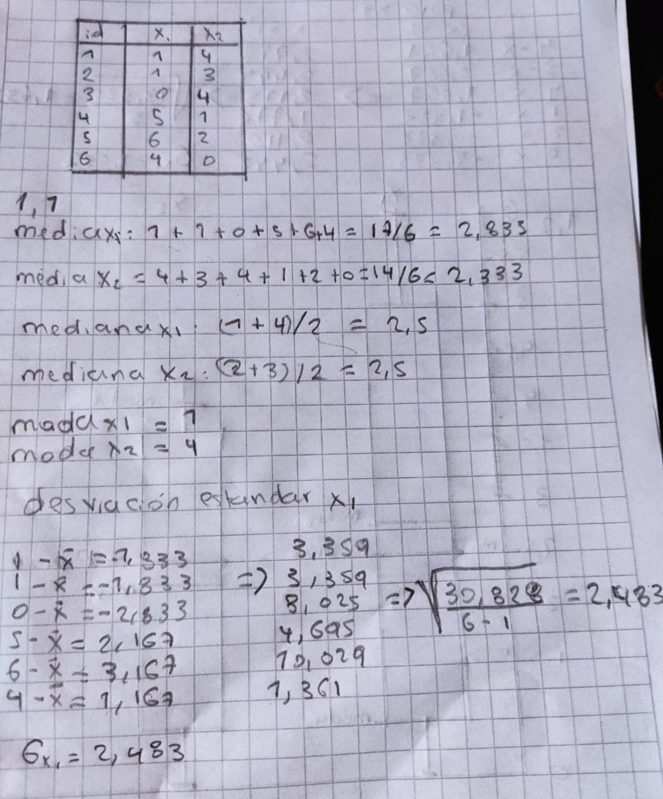
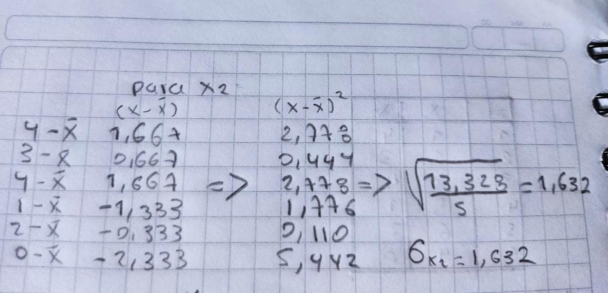
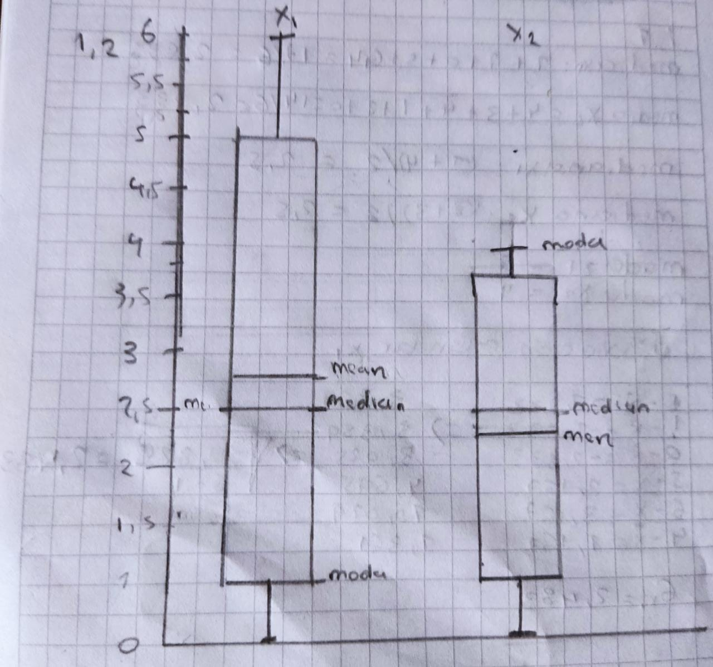

# Solucion Punto 1

### solucion punto 1.1, calcular la media, mediana, moda y desviacion standar, adjunto dos imagenes con todo el procedimiento asociado
- 
- 

### Solucion punto 1.2 dibujar un boxplot a mano

### Solucion 1.3
